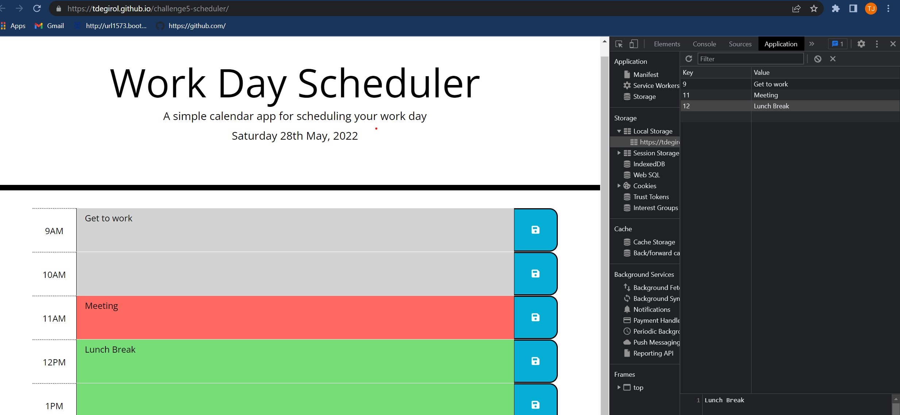

# challenge5-scheduler

## Introduction

Challenge 5 scheduler assignment utilizes moment, localStorage, and starter code that contains bootstrap framework. It is a straight forward application for users to build and save a workday calendar with hourly tasks.

## Installation

To install this project, clone the repository:
    git@github.com:Tdegirol/challenge5-scheduler.git

To visit the webpage on github please follow the link below:
    https://github.com/Tdegirol/challenge5-scheduler

To view the website please follow the link below:
    https://tdegirol.github.io/challenge5-scheduler/

## Usage

The scheduler allows the user to input tasks and save them on a page with current date, and color coded hourly tasks. Grey for past hours, red for current, green for upcoming hours. The image below shows the page in use including the local storage of the tasks:

## Credits

Our professor and TA's! Rommel, Charlie, and Donnahue through class and office hours.

credit for timeBlockColor function: https://github.com/mmeii/work-day-scheduler/blob/main/Assets/script.js
credit for localstorage: https://github.com/sylviaprabudy/work-day-scheduler/blob/master/assets/js/script.js